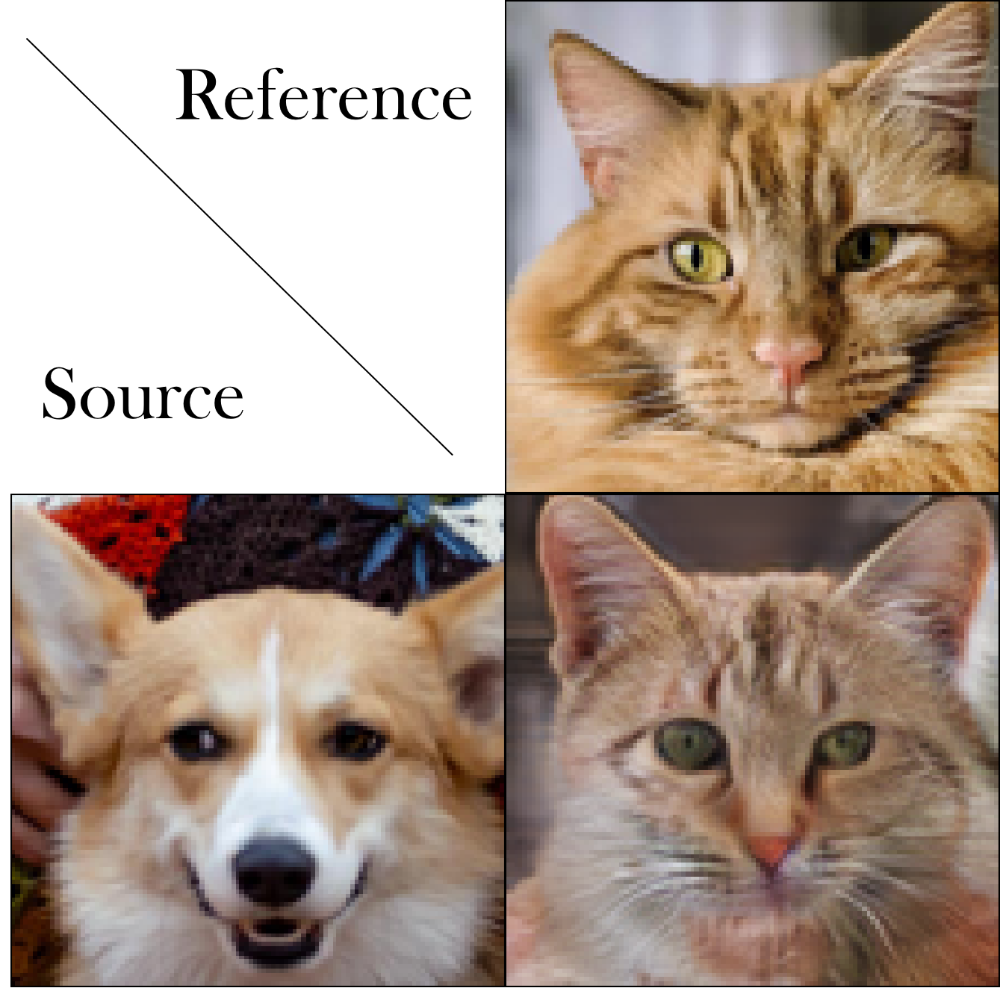

# This is only a demo for 2Cat task

- A simplified version, may contains some bugs.
- Only training on 112*112 images with 100 epochs (around 50k iteration with batchsize of 8)
- No MsDisc and SN
- Pretrained weights of this demo is available at ./output

### Result

