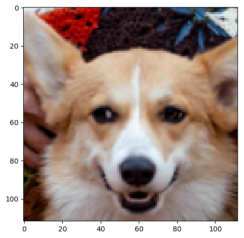
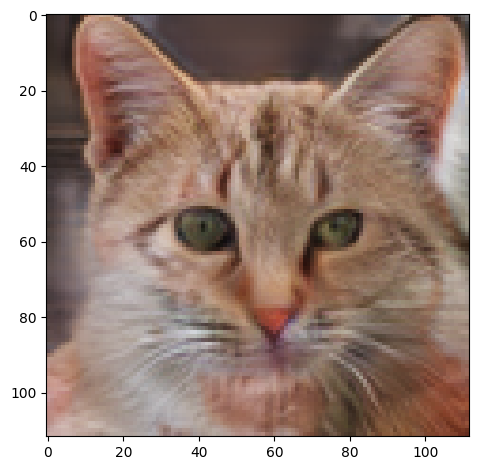

# This is only a demo for 2Cat task

## The official version is still under construction

- Only training on 112 * 112 images with 100 epochs
- No MsDisc and SN

### Input

### Target

### Output

